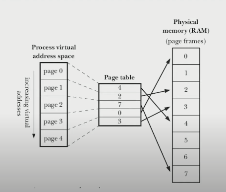

[toc]

# Memory

## Structure

### Text segment

A place that contains operations that a process will execute

### Initialized data

Segment containing global variables and static variables initialized by the programmer

### Uninitialized data

Segment containing global variables and static variables which are initialized with 0 or no initialization is done explicitly in the source code

### Stack

A segment containing automatic variables that have information regarding the function being called. The stack also contains the address to which a function should return and some information regarding the function call.

### Heap

The segment where dynamic memory allocations are located. Usually filled by dynamic variables that we programmed.

## Virtual Memory

- Help a process to gain physical memory space
- Can help when a process need shared memory

### Types

#### Spatial Locality

Instructions or data close to the current memory location that is being fetched may be needed soon in the future.

#### Temporal Locality

The current data or instructions that are being fetched may be needed immediately, so they need to be stored in cache memory in order to avoid repeated searching.

### Components

- Page Table
- Physical RAM

### Advantages

1. RAM usage is more efficient, more processes can be accommodated by RAM
2. Virtual memory has a size larger than RAM
3. The virtual memory pages are loaded into RAM as needed
4. Each process manifests itself from other processes and the kernel
5. Sharing memory between processes is easier because the kernel only redirects 2 pages directly to the same 1 RAM segment
6. The size of a process's memory usage can be larger than the size of existing RAM
7. The program will run faster because only part of it needs to be stored in memory

### Disadvantages

1. Page size is crucial
2. Reduces system stability
3. Performance is not the same as RAM
4. Allows programs that require more memory than RAM capacity to run.
5. Reducing the capacity of the disk

## Command Line Arguments

- argv = list of arguments
- argc = number of arguments

## `brk()` and `sbrk()`

- For changing data segment size
- `brk()` sets the end of the data segment
- `sbrk()` increments the program data space

## `malloc()` and `free()`

- `malloc()` for creating a memory space
- `free()` clear the memory space

### `malloc()` Implementation

1. Scan in the free block list
2. Find correct size or bigger size
3. If found and the size is correct
   1. Return the address
4. If found and the size is bigger
   1. Slice the segment
   2. Return the address of correct size
   3. Connect the remaining size into free block list
5. If not found
   1. Increase the page break using `sbrk()`

### How `malloc()` managing free memory

1. Place length of block in the first part of the segment

2. Place a pointer to next free block and previous free block in the segment

## Memory Leak

### Definition

Memory leaks is a condition where the programmer creates data on the heap but forgets to delete it so that there is unused memory space

### When It Occured

1. There is an allocated memory block by malloc but the programmer forgets to release after use
2. Resources that were opened but not closed
3. In the Java language, the use of a static variable on a single object will generate a garbage collector for the object after we execute a function that uses the static variable.

