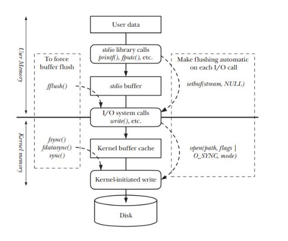
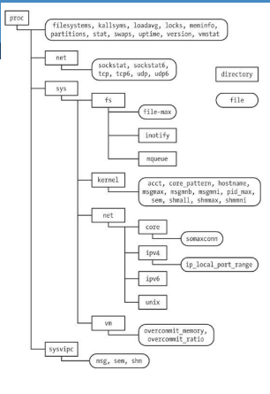

[toc]

# Make

- Make is an utility to maintain groups of programs
- Make contains dependencies and how to build the software
- Use `make` command to use the Makefile

## Structure

 ```makefile
target_1 : dependency list_1
	cmdlist_1
	
target_2 : dependency list_2
	cmdlist_2
 ```

Default target is the first target of the `Makefile` or target that assigned to variable `.DEFAULT_GOAL`. If the target is an executable of a c/c++ program that exist in the same directory of the `Makefile`

## Feature

### Variable

```makefile
DEP = a1.o a2.o
FLAGS = -rf
COMMAND = rm
TARGET_DIR = ~/
TARGET_FOLDER = test_folder

move:
	cd $(TARGET_DIR)

all: $(DEP)
	$(COMMAND) $(FLAGS) $(TARGET_FOLDER)
```

 # Buffer

## Structure



### Flow

1. Program print using printf()
2. Printing the data to stdio buffer
3. After fflush() called data move to I/O system calls and call write()
4. Data move to kernel buffer
5. Kernel write to Disk after fsync() called

## Buffer in Terminal and File in C Program

### In Terminal

- Using line-oriented buffering concept
- Flush stdio buffer when find '\n'

### In File

- Using standard buffering 
- Flush stdio buffer when program exit

# System Limit

## Function List

- `sysconf` for getting OS configuration information at runtime
- `fpathconf` for getting configuration values for files

## SUSv3 Limits

| Name of Limit  | Min Value | Sysconfg() Name    |
| -------------- | --------- | ------------------ |
| ARG_MAX        | 4096      | _SC_ARG_MAX        |
| -              | -         | _SC_CLK_TCK        |
| LOGIN_NAME_MAX | 9         | _SC_LOGIN_NAME_MAX |
| OPEN_MAX       | 20        | _SC_OPEN_MAX       |
| NGROUPS_MAX    | 8         | _SC_NGROUPS_MAX    |
| none           | 1         | _SC_PAGESIZE       |
| RTSIG_MAX      | 8         | _SC_RTSIG_MAX      |
| SIGQUEUE_MAX   | 32        | _SC_SIGQUEUE_MAX   |
| STREAM_MAX     | 8         | _SC_STREAM_MAX     |
| NAME_MAX       | 14        | _PC_NAME_MAX       |
| PATH_MAX       | 256       | _PC_PATH_MAX       |
| PIPE_BUF       | 512       | _PC_PIPE_BUF       |

# Proc File

## Structure

