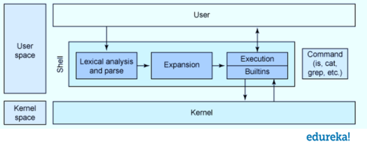

[toc]

# Shell

Shell is an interactive program to read commands typed by user and execute the correct program corresponding to the command. Shell also a program that bridge user to use kernel services.

## Shell Structure

## Kind of Shell

- SH (Bourne Shell)
- CSH (C shell)
- KSH (Korn shell)
- BASH (Bourne again shell)

## Redirection and Pipe

| Arrow        | Purpose                        |
| ------------ | ------------------------------ |
| >            | redirect stdout to a FD        |
| <            | redirect stdin from a FD       |
| >>           | append to a FD                 |
| cmd1 \| cmd2 | pipe cmd1 output to cmd2 input |

## Special Variable of Shell Script

| Variable | Purpose                                                      |
| -------- | ------------------------------------------------------------ |
| $0       | Filename of the script                                       |
| $n       | Nth argument passed to the script when invoked or the function |
| $#       | Number of argument passed to script or function              |
| $@       | All arguments passed to script or function                   |
| $*       | Same as $@                                                   |
| $?       | Exit status of the last command executed                     |
| $$       | The process ID of the current shell. For shell scripts, return the PID of the script |
| $!       | The process number of the last background command.           |

## Comparison Operators

### Integer Comparison

- Format [ "$a" C "$b" ]

| Comparison (C) | Meaning                     |
| -------------- | --------------------------- |
| -eq            | is equal to                 |
| -ne            | is not equal to             |
| -gt            | is greater than             |
| -ge            | is greater than or equal to |
| -lt            | is less than                |
| -le            | is less than or equal to    |

- Format (( "$a" D "$b" ))

| Comparison (D) | Meaning                  |
| -------------- | ------------------------ |
| <              | less than                |
| <=             | less than or equal       |
| >              | greater than             |
| >=             | greater than or equal to |

### String Comparison

- Format [ "$a" E "$b" ]

| Comparison (E) | Meaning                                 |
| -------------- | --------------------------------------- |
| =              | equality                                |
| ==             | same as =                               |
| !=             | not equal                               |
| <              | less than (ASCII alphabetical order)    |
| >              | greater than (ASCII alphabetical order) |

- Format [ F "$a" ]

| Comparison (F) | Meaning  |
| -------------- | -------- |
| -z             | null     |
| -n             | not null |

### File Test

- Format [ G "$a" ]

| Comparison (G) | Meaning                                                     |
| -------------- | ----------------------------------------------------------- |
| -e             | File exists                                                 |
| -f             | is a regular file                                           |
| -s             | is a not zero size                                          |
| -d             | is a directory                                              |
| -b             | is a block device                                           |
| -c             | is a character device                                       |
| -p             | is a pipe                                                   |
| -h             | is symbolic link                                            |
| -r             | file has read permission (for the user running the test)    |
| -w             | file has write permission (for the user running the test)   |
| -x             | file has execute permission (for the user running the test) |

## Common Command

| Command | Purpose                         |
| ------- | ------------------------------- |
| chown   | change owner                    |
| tar     | compress folder to tar file     |
| mkdir   | create directory                |
| pushd   | push a directory to dirs stack  |
| popd    | pop a directory from dirs stack |

## `tar` Command

### Flag

| Flag       | Purpose                     |
| ---------- | --------------------------- |
| -c         | create a new archive        |
| -v         | verbose output              |
| -f  <file> | use archive file            |
| -z         | filter through gzip         |
| -j         | filter through bzip2        |
| -x         | extract an archive          |
| -C         | target extract directory    |
| -t         | list contents of an archive |
